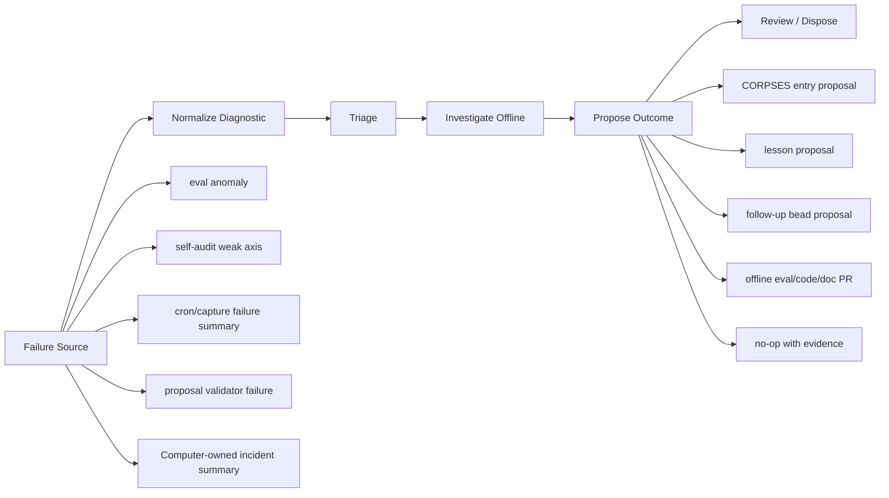

# RFC-004: Fail-Closed Diagnostic Feedback Loop

- Status: Proposed
- Owner: Shared: Teammate owns offline diagnostic contracts, validators, PRs, and follow-up beads; Computer owns live/runtime evidence capture, connector-bearing logs, account/order state, and final disposal
- Created: 2026-06-28
- Related Beads: `teammate-yr7.4`, parent `teammate-yr7`
- Scope Boundary: this RFC is design-only. It does not implement production services, live connector calls, Robinhood access, live market/account/order APIs, web/search capture, scanner runs, `pplx_sdk`, or mutation of observed/generated/live state such as `runs/sentiment/*`, `STATE.md`, `runs/QUEUE.json`, `runs/SELF_AUDIT.md`, `state/*`, `runs/ARMED/*`, `runs/EXECUTED/*`, `runs/CLOSED/*`, or `runs/KILLED/*`.

## Problem

The Fund already has strong offline safety/eval practices for specific surfaces: Charter rails,
proposal schemas, observed-vs-simulated sentiment boundaries, CORPSES discipline, and lessons
distillation. What is missing is the loop that turns runtime failures into durable improvement.

Today, a runtime failure can appear in many places: a cron/capture miss, an eval anomaly, a killed
thesis, a PR queue issue, a self-audit weak axis, a proposal validation failure, or a Computer-only
connector/execution incident. Some of those have places to land (`runs/CORPSES.md`,
`corpus/lessons.md`, `corpus/improvement_log.md`, Beads, or PRs), but there is no typed diagnostic
contract that decides what should be investigated, who owns it, what evidence is allowed, and which
state changes are explicitly forbidden.

Without that contract, the Fund risks two opposite failures:

- **Lost learning:** failures are summarized in prose but never become reusable lessons, regression
  evals, or follow-up work.
- **Unsafe automation:** a diagnostic agent overreaches from “found a failure” into touching live
  capture/execution state, weakening owner boundaries, or laundering thin evidence into a trade
  signal.

The target is a fail-closed diagnostic feedback loop: runtime failures should automatically become
structured, reviewable diagnostics and proposed improvements, but no diagnostic output should be able
to authorize execution, mutate live state, or cross the Teammate/Computer boundary.

## Context and Constraints

- `CHARTER.md` is LAW: no look-ahead, no fabrication, simulated data remains labeled, review-before-
  place is mandatory, account allowlists and sizing ladders remain hard rails, and kill-switches must
  stay fail-closed.
- `HANDOFF.md` fixes the role split: Teammate proposes and owns offline engineering/evals/research;
  Computer disposes and owns live connectors, broker/account state, order review, execution, and live
  evidence capture.
- `evals/run_offline_evals.py` already exercises safety rails, observed/simulated boundaries,
  proposal validation, lead-lag/CAP falsification, source weighting, and CORPSES/lessons discipline
  without connectors.
- `evals/corpses_lessons.py` validates that killed-thesis entries and lessons include required
  fields and explicitly forbid live execution touchpoints.
- `evals/proposed_validator.py` validates proposal artifacts and rejects execution-authorizing
  content in Teammate-authored proposals.
- `runs/SELF_AUDIT.md` is generated state and must not be edited by Teammate. It can be read as an
  input signal, then copied into a proposed diagnostic artifact only if the source commit/path is
  recorded.
- `runs/CORPSES.md` and `corpus/lessons.md` are durable learning surfaces, but direct automation into
  them should be gated. A diagnostic loop should first propose entries, then have Computer or a
  human/Teammate PR review merge them.
- `/home/dev/agi` has an ASI diagnostic pipeline pattern worth adapting: pull diagnostic logs,
  triage entries, investigate actionable clusters in an isolated sandbox, and report PR/ticket/no-op
  outcomes. Computer Fund should adopt the shape, not the production dependencies: no Datadog/Slack
  writes, no live session fetches, and no automatic mutation of live state.

## Options Considered

1. **Manual prose-only loop.**
   - Benefits: minimal code and no new state-machine surface.
   - Costs: weak replayability, inconsistent owner routing, repeated rediscovery of failure classes,
     and no schema/eval gate for “diagnostic” claims.
   - Failure mode: incidents become Slack/HANDOFF prose but never become regression tests, lessons, or
     kill/reopen criteria.

2. **Direct auto-write into CORPSES/lessons/QUEUE.**
   - Benefits: fast closure from failure to memory.
   - Costs: mutates canonical learning and queue state before review; risks mixing diagnostic
     inference with accepted doctrine; can create noisy self-improvement churn.
   - Failure mode: a weak or duplicated diagnostic edits durable state, causing future agents to treat
     unreviewed hypotheses as accepted lessons.

3. **Offline proposed-diagnostic artifacts plus validators.**
   - Benefits: typed, reviewable, CI-validatable, owner-aware, and consistent with RFC-002 repo-as-
     substrate. Diagnostics can propose CORPSES entries, lessons, evals, docs, code changes, and Beads
     without directly mutating owner-controlled state.
   - Costs: one extra review step before memory/queue updates become canonical.
   - Failure mode: if validators are too loose, proposals could smuggle execution intent; if too
     strict, diagnostics become high-friction and underused.

4. **AGI-style production diagnostic service now.**
   - Benefits: closer to the mature ASI pattern: scheduled pull, triage, investigation, reporting,
     and automatic PR creation.
   - Costs: too much operational surface for this repo now; would need credentials, logs, live
     captures, and write permissions that violate current sal-bot boundaries.
   - Failure mode: production convenience erodes the hard split between Teammate diagnostics and
     Computer-owned live connector/execution authority.

## Decision

Adopt option 3 first: an offline proposed-diagnostic contract and validator-backed loop. The Fund
should copy the AGI diagnostic pipeline's stage boundaries, but implement them as repo-local,
connector-free artifacts:



The first implementation should be propose-only and offline-only. It may read committed repo files
and fake fixtures. It must write only to reviewable proposed-diagnostic paths or a Teammate PR. It
must never write directly to live/generated state or execution state.

## Design

### Diagnostic Sources

Allowed source classes:

| Source class | Example inputs | Owner | Allowed Teammate access |
|---|---|---|---|
| `offline_eval_failure` | failed `evals/run_offline_evals.py`, `evals/proposed_validator.py`, or targeted fixture eval | Teammate | read command output, committed fixtures, and changed files |
| `self_audit_anomaly` | weak axis from `runs/SELF_AUDIT.md` | Computer generates; Teammate may inspect | read-only snapshot reference; no edits to generated file |
| `corpse_or_lesson_gap` | missing fields or unlinked lessons from `runs/CORPSES.md` / `corpus/lessons.md` | Shared | read committed Markdown; propose patches only |
| `cron_or_capture_failure` | sanitized cron failure summary committed by Computer | Computer | read committed summary only; no live cron/scanner/web reruns |
| `computer_incident_summary` | Computer-authored incident artifact with sanitized evidence | Computer | read committed summary only; no broker/account/order/log connector access |
| `pr_review_failure` | PR review/CI issue, branch conflict, schema drift | Teammate | inspect git/CI artifacts available through normal PR workflow |

Forbidden source classes for Teammate diagnostics:

- direct Robinhood, live market, account, order, or review APIs;
- live web/search capture, scanners, `pplx_sdk`, and Computer-only connector tools;
- mutation or regeneration of `runs/sentiment/*`, `STATE.md`, `runs/QUEUE.json`,
  `runs/SELF_AUDIT.md`, `state/*`, or `runs/{ARMED,EXECUTED,CLOSED,KILLED}/*`;
- any input that cannot be represented as a committed repo path, fake fixture, or Computer-authored
  sanitized incident summary.

### Proposed Artifact Location

Add a new reviewable namespace:

```text
runs/DIAGNOSTICS/PROPOSED/<diagnostic_id>.json
runs/DIAGNOSTICS/README.md
```

This namespace is intentionally separate from `runs/PROPOSED/` strategy proposals. Diagnostic
artifacts are about improving the system, not proposing a trade thesis. They must be incapable of
authorizing order review, order placement, sizing, ARMED transitions, or live capture.

The validator should treat every diagnostic artifact as untrusted until it passes schema, ownership,
provenance, and forbidden-action checks.

### Diagnostic Envelope

Each proposed diagnostic should use an envelope like:

```json
{
  "schema_version": "cf.diagnostic.v1",
  "diagnostic_id": "diag-2026-06-28-example-eval-failure",
  "state": "PROPOSED",
  "created_at": "2026-06-28T00:00:00Z",
  "writer": "teammate",
  "owner": "teammate",
  "source_commit": "<git-sha>",
  "source_class": "offline_eval_failure",
  "severity": "medium",
  "summary": "Offline proposal validation failed because a Teammate artifact included execution intent.",
  "evidence": {
    "repo_paths": ["evals/proposed_validator.py", "runs/PROPOSED/example.json"],
    "commands": ["env -u PYTHONPATH python -m evals.proposed_validator runs/PROPOSED/example.json"],
    "observed_outputs": ["runs/PROPOSED/example.json.payload.non_authorizations missing no_order"],
    "external_refs": []
  },
  "triage": {
    "label": "Y",
    "category": "schema_boundary",
    "reason": "The failure can be prevented by a validator or fixture update.",
    "route_to": "teammate"
  },
  "investigation": {
    "root_cause": "Proposal schema allowed or did not clearly explain a forbidden action pattern.",
    "confidence": "medium",
    "reproducible_offline": true,
    "open_questions": []
  },
  "proposed_outcomes": [
    {
      "type": "code_pr",
      "owner": "teammate",
      "title": "Tighten proposal validator forbidden-action checks",
      "details": "Add offline fixture coverage for the forbidden payload pattern."
    },
    {
      "type": "lesson_entry_proposal",
      "owner": "shared",
      "target_path": "corpus/lessons.md",
      "details": "Propose a lesson only after the validator PR proves the pattern."
    }
  ],
  "non_authorizations": [
    "no_order",
    "no_sizing",
    "no_execution_instruction",
    "no_live_capture",
    "no_state_mutation"
  ]
}
```

Required envelope fields:

- `schema_version`, `diagnostic_id`, `state`, `created_at`, `writer`, `owner`, `source_commit`,
  `source_class`, `severity`, `summary`, `evidence`, `triage`, `investigation`,
  `proposed_outcomes`, and `non_authorizations`.
- `state` must be `PROPOSED` for Teammate-authored artifacts.
- `writer=teammate` artifacts must set `owner` to `teammate`, `computer`, or `shared`, but `owner`
  only means routing; it does not grant authority to mutate the owner's state.
- `source_commit` must be a full or short git SHA from the repo state used for diagnosis.
- `evidence.repo_paths` must be repo-relative paths. Missing or uncommitted external evidence should
  force the diagnostic to fail validation unless represented as a Computer-authored sanitized summary.
- `non_authorizations` must include `no_order`, `no_sizing`, `no_execution_instruction`,
  `no_live_capture`, and `no_state_mutation`.

### Triage Categories

Start with a small routing taxonomy:

| Category | Investigate when | Typical owner | Common outcome |
|---|---|---|---|
| `charter_boundary` | a flow could weaken safety rails, simulated labels, review-before-place, or account allowlist | Shared, with Computer disposing live implications | docs/code PR, lesson, blocker |
| `schema_boundary` | a proposal/diagnostic/artifact schema allows ambiguity or forbidden fields | Teammate | validator PR, fixture, docs |
| `eval_gap` | a runtime failure lacks a regression eval or an eval anomaly lacks a root cause | Teammate | offline eval PR, follow-up bead |
| `observability_gap` | the root cause cannot be proven from committed evidence | Computer for live evidence; Teammate for offline instrumentation | Computer evidence request or o11y PR |
| `corpse_lesson_gap` | a killed thesis lacks required CORPSES/lesson structure or seeder feedback | Shared | proposed Markdown patch |
| `capture_infra` | sanitized capture/cron evidence shows missed ticks, stale series, or brittle wrappers | Computer for live capture; Teammate for wrapper/eval docs | owner-routed bead or offline PR |
| `owner_boundary` | proposed work crosses Teammate/Computer authority | Shared | fail-closed no-op, docs PR |

Triage labels:

- `Y`: actionable offline investigation is possible from committed evidence or fake fixtures.
- `N`: non-actionable, duplicate, expected/accepted risk, or requires live evidence Computer has not
  committed.
- `BLOCKED_OWNER`: likely real, but blocked on Computer-owned evidence or disposal.
- `BLOCKED_SCOPE`: would require forbidden live connector/execution/capture access.

Only `Y` diagnostics may spawn code/docs PR work by Teammate. `BLOCKED_OWNER` and `BLOCKED_SCOPE`
may propose a follow-up bead or Computer evidence request, but must not self-resolve by crossing the
boundary.

### Investigation Rules

The offline investigator should cluster by root cause, not by symptom count. For each cluster it must
answer:

1. What failed, and what exact committed evidence proves it?
2. Which Charter or handoff boundary constrains the response?
3. Can the failure be reproduced offline with fake fixtures or committed artifacts?
4. Is this a code bug, schema gap, eval gap, docs gap, lesson/CORPSES gap, owner-boundary issue, or
   accepted no-op?
5. What is the smallest proposed outcome that makes recurrence less likely?

The investigator must not:

- infer a trading signal from diagnostic evidence;
- promote a proposal into `ARMED`, `EXECUTED`, `CLOSED`, or `KILLED`;
- edit generated/live state;
- call live connectors or capture scripts;
- close or mutate Beads/issues without explicit owner approval.

### Proposed Outcomes

Allowed outcome types:

| Outcome type | Meaning | Who disposes |
|---|---|---|
| `code_pr` | offline code/schema/eval/doc change | Teammate PR review |
| `docs_pr` | RFC, README, handoff, or doctrine update | Teammate PR review |
| `eval_pr` | regression fixture or offline validator | Teammate PR review |
| `corpse_entry_proposal` | proposed `runs/CORPSES.md` entry text | Computer or reviewed PR |
| `lesson_entry_proposal` | proposed `corpus/lessons.md` entry text | Computer or reviewed PR |
| `bead_proposal` | follow-up work item suggestion, not an automatic create/update | Owner/master |
| `computer_evidence_request` | request for sanitized committed evidence from Computer | Computer |
| `no_op` | evidence says no action is needed | Diagnostic report only |

Forbidden outcome types:

- any order, sizing, price target, execution, ARMED transition, or broker/account action;
- any live capture/scanner run request executed by Teammate;
- any mutation of generated state or Computer-owned execution state;
- any automatic closure of an owner-controlled task, issue, or incident.

### Fail-Closed Gates

The diagnostic loop should reject or downgrade to `BLOCKED_SCOPE` when:

- required evidence is missing, uncommitted, or not attributable to a source commit;
- source evidence is live-only and not represented by a Computer-authored sanitized artifact;
- a proposed outcome contains execution-authorizing language such as buy/sell/place/review/sizing
  instructions;
- a Teammate artifact attempts to write outside diagnostic/proposed/code/docs/eval paths;
- the diagnostic cannot reproduce the failure offline and lacks a clear owner evidence request;
- multiple root causes are mixed into one proposed change without separate routing;
- the same symptom has an existing open diagnostic/Bead/PR and the new artifact adds no evidence.

### Relationship to CORPSES and Lessons

Diagnostics should feed `runs/CORPSES.md` and `corpus/lessons.md` by proposal, not direct mutation.

A `corpse_entry_proposal` should include the same required fields enforced by
`evals/corpses_lessons.py`: `Status`, `Evidence type`, `Thesis`, `Kill reason`, `Lesson`, `Seeder
feedback`, and `Reopen criteria`.

A `lesson_entry_proposal` should include: `Source corpse`, `Reusable lesson`, `Seeder rule`,
`Meta/eval linkage`, and `Revisit trigger`.

If a runtime failure is not a killed thesis, the diagnostic should prefer an improvement-log or eval
outcome over a CORPSES entry. CORPSES remains for dead theses/strategies, not every operational bug.

### Relationship to Beads

Diagnostics may propose Beads but should not create or mutate them without owner/master approval. A
`bead_proposal` should carry:

- title;
- problem statement;
- acceptance criteria;
- owner suggestion (`teammate`, `computer`, or `shared`);
- source diagnostic ID;
- evidence paths;
- explicit forbidden actions.

This preserves the master/owner boundary while making follow-up work easy to create deliberately.

## Implementation Sequence

1. **Design artifact PR.** Land this RFC as the owner-reviewed contract before code.
   - Validation: Markdown review plus confirmation that no live/generated state changed.

2. **Diagnostic schema and fake fixtures.** Add `runs/DIAGNOSTICS/README.md`, one fake proposed
   diagnostic fixture under an eval fixture path, and `evals/diagnostics_validator.py`.
   - Validation: `env -u PYTHONPATH python -m evals.diagnostics_validator <fixture>`.
   - Must reject execution language, missing `non_authorizations`, missing `source_commit`, and
     non-repo evidence paths.

3. **Offline intake from eval output.** Add a script that can convert a saved offline eval failure log
   or hand-written fake fixture into a proposed diagnostic JSON.
   - Validation: feed fake failing logs; assert generated artifacts validate and contain no live state
     paths except as read-only evidence references.

4. **CORPSES/lessons proposal renderer.** Add a renderer that emits Markdown proposal blocks from a
   diagnostic artifact but does not edit `runs/CORPSES.md` or `corpus/lessons.md` directly.
   - Validation: generated Markdown satisfies the field checks from `evals/corpses_lessons.py` when
     pasted into temporary test documents.

5. **Self-audit integration as read-only input.** Allow the intake script to read a committed
   `runs/SELF_AUDIT.md` snapshot and propose diagnostics for weak axes without editing the snapshot.
   - Validation: fake/self-contained fixture first; no writes to `runs/SELF_AUDIT.md` or `STATE.md`.

6. **Owner-routed reporting.** Summarize diagnostics into a PR body, Bead proposal text, or Computer
   evidence request. Do not post Slack/issue comments or mutate Beads unless explicitly delegated.
   - Validation: generated report is deterministic and contains provenance plus non-authorization
     language.

## Falsifiable Success Criteria

The loop is useful only if these become true:

- Every diagnostic artifact validates offline before review.
- Invalid artifacts fail closed for missing evidence, forbidden source classes, forbidden outcome
  types, execution language, or owner-boundary violations.
- At least one fake eval failure can be converted into a diagnostic, triaged as `Y`, and rendered into
  a proposed eval/code/docs PR outcome without touching live/generated state.
- At least one fake Computer-owned incident summary can be triaged as `BLOCKED_OWNER` with a precise
  evidence request instead of Teammate attempting live access.
- Proposed CORPSES/lesson entries generated from diagnostics satisfy existing field discipline before
  becoming canonical Markdown.
- Diagnostic output improves future checks: a repeated failure class should point to an existing
  diagnostic, lesson, eval, PR, or bead proposal rather than creating a duplicate from scratch.

Rollback or redesign is required if:

- diagnostics create noisy PRs without clear root-cause clustering;
- validators miss execution-authorizing language or live-state writes;
- owner routing causes Teammate to request or use Computer-only connectors;
- diagnostics are treated as trading evidence rather than system-improvement evidence;
- proposed lessons become canonical without review.

## Open Questions

- Should accepted diagnostic artifacts later move to `runs/DIAGNOSTICS/ACCEPTED/`, or should git/PR
  history be the only acceptance record?
- Should Computer author its own `writer=computer` diagnostic summaries, or should Computer commit
  sanitized incident summaries that Teammate wraps into diagnostics?
- Which paths should CI watch first: only `evals/`, `runs/PROPOSED/`, and `runs/DIAGNOSTICS/`, or all
  state-machine directories?
- How aggressive should duplicate detection be before a diagnostic is considered redundant with an
  existing Bead, PR, CORPSE, or lesson?
- When should a diagnostic be promoted into durable doctrine versus remain a one-off incident report?
